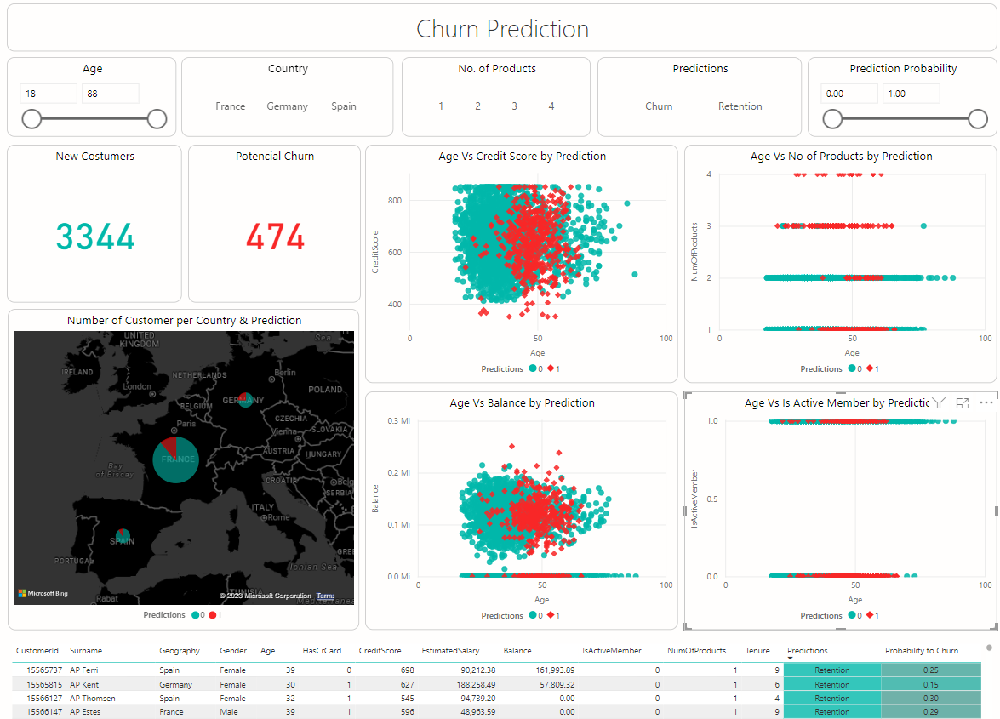

# Churn Predict - Readme
## Descrição do Projeto
O projeto Churn Predict é uma aplicação que utiliza técnicas de aprendizado de máquina para prever a rotatividade de clientes (churn) em uma empresa. 
O objetivo é identificar quais clientes têm maior probabilidade de cancelar seus serviços.

Foram explorados vários algoritmos de classificação, incluindo 
logistic regression, k-nearest neighbors (k-NN), decision tree classifier, random forest e XGBoost. 
Após a avaliação de desempenho desses modelos, o melhor modelo foi escolhido para passar por um processo de sintonia de hiperparâmetros.

O modelo escolhido foi então incorporado em um dashboard interativo para facilitar a visualização dos resultados da previsão de churn.

## Dashboard

